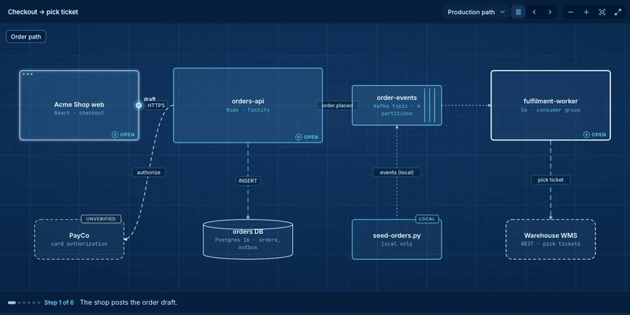
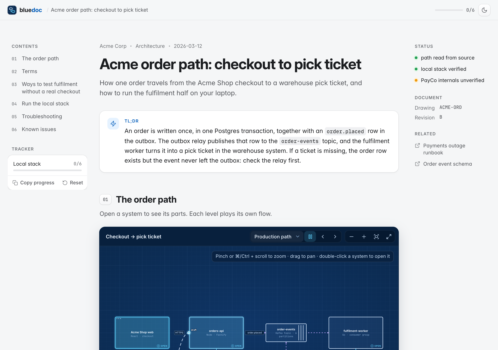
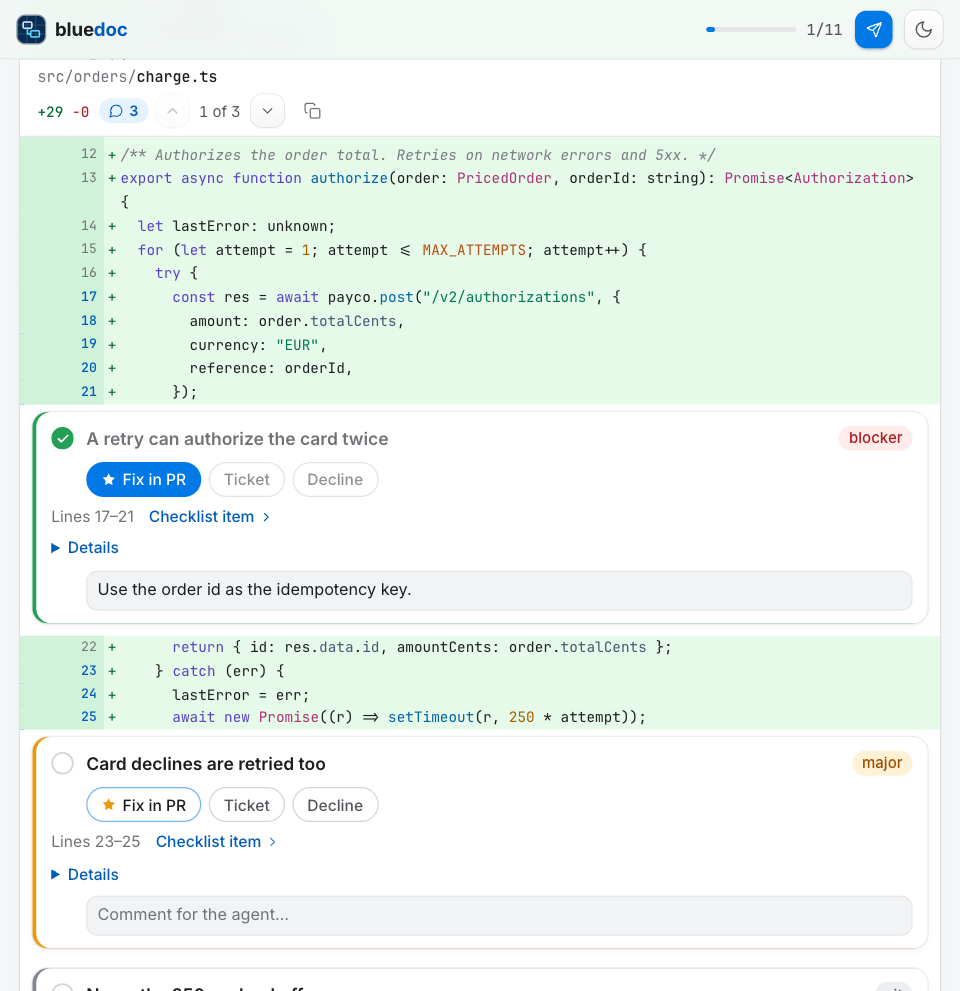

# bluedoc



An agent skill that writes engineering docs as one self-contained HTML page: a zoomable blueprint of the system, checklists that remember your ticks, and a code browser that pins review findings to their lines. Works with Claude Code, Codex, pi and omp.

## What you get

- **Blueprint canvas.** Open a system to see its parts; each level plays its own animated flow (request, event, data). Nests 3 levels deep.
- **Checklists as task trackers.** Every procedure is a checklist. Ticks persist in the reader's browser; **Copy progress** exports Markdown for a PR or issue.
- **Code review.** A `diff` block shows a change with each finding as a comment on its lines. Ticking a comment ticks the finding. Generated from git by `gitdiff.py`.
- **One file.** No network at view time, works from `file://`, prints cleanly, light and dark theme, keyboard and screen-reader outline.
- **Linted writing.** The build flags filler, vague words, long sentences and checklist items that don't start with a verb.

| The page | A review finding on its code |
|---|---|
|  |  |

Open the examples in a browser to try them: [`acme-orders.html`](skills/bluedoc/examples/acme-orders.html) (architecture and runbook) and [`acme-pr-review.html`](skills/bluedoc/examples/acme-pr-review.html) (PR review). Download the file, then open it; GitHub shows HTML as source.

## Install

Pick your agent. Each one installs the same skill from this repository.

### Claude Code

```sh
claude plugin marketplace add andreiverdes/bluedoc
claude plugin install bluedoc@bluedoc
```

Inside a session the same commands are `/plugin marketplace add andreiverdes/bluedoc` and `/plugin install bluedoc@bluedoc`. Start a new session to load the skill.

### Codex

```sh
codex plugin marketplace add andreiverdes/bluedoc
codex plugin add bluedoc@bluedoc
```

Restart Codex. The skill is listed as `bluedoc:bluedoc`; mention it with `$bluedoc` or let Codex pick it from your request.

### pi

```sh
pi install git:github.com/andreiverdes/bluedoc
```

Restart pi. Run it as `/skill:bluedoc` or let pi pick it from your request.

### omp

```sh
omp plugin marketplace add andreiverdes/bluedoc
omp plugin install bluedoc@bluedoc
```

Run `/reload-plugins` in an open session, or start a new one.

### Any other agent

With the [skills CLI](https://skills.sh):

```sh
npx skills add andreiverdes/bluedoc
```

Or copy the skill folder by hand. Codex, pi and omp read `~/.agents/skills`; Claude Code reads `~/.claude/skills`.

```sh
git clone https://github.com/andreiverdes/bluedoc.git
ln -s "$PWD/bluedoc/skills/bluedoc" ~/.agents/skills/bluedoc
```

### Requirements

- Python 3.9 or later on `PATH` (the build and diff scripts use the standard library only).
- `git`, for code reviews.
- A browser tool in your agent is optional. With one, the agent checks the page at three widths before it reports.

## Use

Ask in plain words. The skill triggers on requests for HTML docs, architecture pages, walkthroughs, runbooks and browsable reviews.

- "Write a bluedoc of how a request flows through this service."
- "Make a runbook for setting up the local stack, as a bluedoc with checklists."
- "Review PR 412 and give me a bluedoc where each finding sits on its code."

The agent writes `docs/<topic>/<name>.bluedoc.json`, builds `docs/<topic>/<name>.html` next to it, and keeps the JSON as the source. To rebuild after editing the JSON by hand:

```sh
python3 <skill>/scripts/build.py docs/<topic>/<name>.bluedoc.json -o docs/<topic>/<name>.html
```

`<skill>` is the installed skill folder, for example `~/.agents/skills/bluedoc`.

## Update and remove

| Agent | Update | Remove |
|---|---|---|
| Claude Code | `claude plugin marketplace update bluedoc` then `claude plugin update bluedoc@bluedoc` | `claude plugin uninstall bluedoc@bluedoc` |
| Codex | `codex plugin marketplace upgrade bluedoc` | `codex plugin remove bluedoc@bluedoc` |
| pi | `pi update` | `pi remove git:github.com/andreiverdes/bluedoc` |
| omp | `omp plugin upgrade bluedoc@bluedoc` | `omp plugin uninstall bluedoc@bluedoc` |
| skills CLI | `npx skills update` | `npx skills remove bluedoc` |

## What's in the repo

```text
skills/bluedoc/
  SKILL.md               instructions the agent follows
  references/schema.md   every JSON field
  scripts/build.py       validate, lint, build the HTML
  scripts/gitdiff.py     git range + findings -> diff block
  assets/template.html   the page runtime (styling, canvas, checklists, diff browser)
  examples/              Acme examples, JSON and built HTML
.claude-plugin/          Claude Code plugin and marketplace (omp reads it too)
.agents/plugins/         Codex marketplace
plugin.json              Agent Plugins manifest (Codex, omp)
package.json             pi package manifest
```

The examples describe Acme Corp, a fictional company.

## License

MIT
